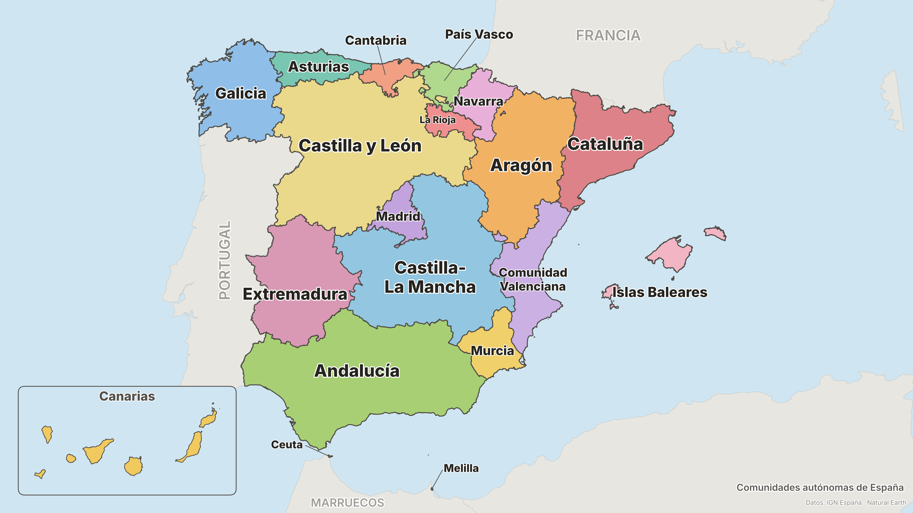

# static-tv-maps

Pedagogical maps of Spain (and Asturias) rendered as static 4000×2250 images,
meant to be dropped in a folder that a TV cycles through in standby/ambient
mode. Labels are sized to be readable from across the room.



## The maps

Everything lands in [`output/`](output/), pre-rendered and committed:

| Map | Contents |
| --- | --- |
| `spain-comunidades` | The 17 autonomous communities (plus Ceuta and Melilla), each colored and named |
| `spain-provincias-1` / `-2` | All 50 provinces, colored by community. The names are split over two maps so every label has room; cramped provinces get leader lines |
| `spain-provincias-numeros` | All 50 provinces labeled with their INE code — the two-digit postal-code prefix — with a full name legend (01–26 in the Atlantic, 27–52 in the Mediterranean) |
| `spain-capitales-provincias` | All 52 province capitals, dot + name, on the community-colored provinces |
| `spain-capitales-comunidades` | The community capitals starred and named (Canarias has two co-capitals) |
| `spain-ciudades` | The 30 most populated municipalities (INE 2025, metro-area satellites excluded), numbered by rank with a population legend in the Atlantic |
| `spain-fisica` | The major rivers (Miño, Duero, Tajo, Guadiana, Guadalquivir, Ebro, Júcar, Segura, Genil, Turia) and mountain systems (Pirineos, Cordillera Cantábrica, Macizo Galaico, Sistema Central, Sistema Ibérico, Montes de Toledo, Sierra Morena, Sistemas Béticos) |
| `spain-rios` | The ~20 rivers a schoolchild learns, across all three watersheds, with the mountain systems shaded underneath |
| `spain-rios-ciudades` | Rivers and the cities they run through — Sevilla/Guadalquivir, Barcelona/Llobregat, Bilbao/Nervión… including Lisboa (Tajo) and Oporto (Duero) |
| `spain-vinos` | The main wine denominations of origin (Rioja, Ribera del Duero, Priorat, Rías Baixas, Jerez…) |
| `spain-despensa` | The "pantry of Spain": jamón, olive oil, huerta/fruit, greenhouses, cheese and seafood regions, color-coded with a legend |
| `asturias-concejos-1` / `-2` | The 78 concejos of Asturias, names split over two maps the same way |
| `asturias-comarcas` | The 8 functional comarcas of Asturias (decree 11/91) |
| `asturias-ciudades` | The main towns of Asturias — every concejo over 10 000 inhabitants |
| `*-mudo` | The same maps without names ("mapa mudo"), for quizzing yourself |

All on-map text is in Spanish. Instead of big titles, each map carries a small
caption in the lower-right corner, so the geography gets every pixel.

The Canary Islands are always present, transposed into a framed inset in the
lower-left Atlantic corner — their real direction of travel from the
peninsula. The inset may cover Portugal or Morocco but never Spain; if space
is tight the archipelago shrinks slightly rather than overlap the peninsula.

## Running it

With Docker (no local dependencies needed):

```bash
make setup      # build the image
make maps       # render all maps into output/
make map M=spain-comunidades   # render one map
make data       # re-download + re-process source geodata (needs network)
make list       # list available map names
```

Without Docker (Python 3.11+):

```bash
make local-setup   # create .venv and install requirements
make local-maps
```

Or directly: `python generate.py all [--jpg]`. The `--jpg` flag also writes
JPEG copies, for TVs that only accept JPEG.

The processed geodata in `data/processed/` is committed, so rendering does not
need network access; only `make data` does.

## Data sources

- **Administrative boundaries** — [Opendatasoft `georef-spain`](https://public.opendatasoft.com/explore/?q=georef-spain)
  (communities, provinces, municipalities), which repackages the official
  boundaries of **IGN España** (Instituto Geográfico Nacional) with clean INE
  codes and names. Simplified with a topology-preserving pass
  (`shapely.coverage_simplify`) to ~100 m, far below one on-screen pixel.
- **Neighbouring countries, rivers, mountain regions** —
  [Natural Earth](https://www.naturalearthdata.com/) 10 m admin-0,
  rivers_lake_centerlines (+ europe supplement) and geography_regions_polys
  (public domain), clipped around Iberia. Ranges missing from Natural Earth
  (Sistema Central, Sistema Ibérico, Montes de Toledo, Macizo Galaico) are
  drawn as hand-placed capsules through their known summits.
- **City locations** — geocoded once via
  [Nominatim](https://nominatim.openstreetmap.org/) (© OpenStreetMap
  contributors, ODbL) and committed to `data/processed/cities.geojson`.
  Populations: INE (padrón, 1 Jan 2025 for Spain; 2023 for Asturias).
  Comarca composition: decree 11/91 of the Principado de Asturias.
- **Wine / food regions** — approximate zones, hand-placed from the Spanish
  Ministry (MAPA) DOP/IGP references and each consejo regulador; the Nervión
  and Llobregat courses (too small for Natural Earth) are traced by hand from
  their source towns. Marked "zonas aproximadas" on the maps.
- Also evaluated: [es-atlas](https://github.com/martgnz/es-atlas) (TopoJSON of
  the same IGN data, journalism-style; too generalized for 4000 px) and raw IGN
  Centro de Descargas (canonical but awkward to script).
- **Font** — [Inter](https://fonts.google.com/specimen/Inter) (SIL OFL),
  bundled in `assets/fonts/`.

## Design notes

- Canvas is exactly 4000×2250 px (16:9), the TV's preferred size.
- Peninsula and Baleares are drawn in ETRS89 / UTM 30N (EPSG:25830), the
  Canaries in UTM 28N (EPSG:25828) before being translated into the inset, so
  every shape keeps its proper metric proportions.
- Provinces inherit their community's color with subtle per-province shading:
  the province maps double as "which community does it belong to" maps.
- Concejos in Asturias are colored by greedy graph coloring so no two
  neighbours share a color.
- Names use common Castilian forms (Álava, Alicante, Castellón, Valencia,
  Islas Baleares) and keep sole-official forms (A Coruña, Ourense, Girona,
  Lleida, Bizkaia, Gipuzkoa). All display names live in
  `tvmaps/style.py` and are trivial to change.

## Tweaking

Label placement is data-driven: each map module has a dict of `Label` specs
with anchor nudges (`dx`, `dy`, in km) or leader-line callouts (`tx`, `ty`).
Colors live in `tvmaps/style.py`. Render, look, nudge, repeat — a full render
of all maps takes ~10 s.

## License

Code under GPL-3.0 (see `LICENSE`). Boundary data © IGN España (CC-BY-style
reuse with attribution), Natural Earth public domain, Inter font SIL OFL 1.1.
